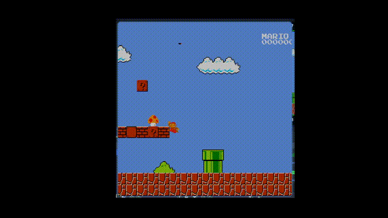

# project-loriaux-varin

## NES emulator in Rust




## Description

A project intending to reproduce the behavior of an actual NES by emulating each hardware component and their interactions.

## Progress

- CPU fully implemented
- Bus implemented
- Cartridges implemented (we only support iNES 1.0 rom files)
- PPU fully implemented
- APU not implemented (= no sound)

## References

- [Writing NES emulator in Rust](https://bugzmanov.github.io/nes_ebook/)
- [Nesdev.org](https://www.nesdev.org/)
    - [Intruction Reference (for CPU 6502)](https://www.nesdev.org/obelisk-6502-guide/reference.html)
    - [Unofficial opcodes](https://www.nesdev.org/wiki/Programming_with_unofficial_opcodes)
    - [PPU registers](https://www.nesdev.org/wiki/PPU_registers)
- [NesHacker - The NES explained](https://www.youtube.com/watch?v=GssRNEaKoPw&list=PLgvDB6LWam2VDGPgUAMTEEMk0PUtCJs-n)
- Similar projects
    - In Rust : [rustness_monster](https://github.com/bugzmanov/rustness_monster/)
    - In C++/C# : [mesen](https://www.emulator-zone.com/nes/mesen)

## Install

```
git clone git@gitlab.enst.fr:net7212/2425/project-loriaux-varin.git 
cd project-loriaux-varin.git
cargo build
```
## Usage

Users are expected to provide the games by putting them in the ```rom_examples```. The roms must be iNES files as other formats are currently not supported.

```
./target/debug/nes_emul
```
You will then be prompted to enter the name of the ```<rom>.nes``` to play


## Testing

- There are some unit tests for the CPU instruction set
- Most of the actual tests were made comparing our logs to known reference logs such as [nestest](https://www.nesdev.org/wiki/Emulator_tests)

## Known bugs

- In game timer inaccurate (runs too fast)
- graphics bugs : 
    - sprites on the left/right borders appear on both sides
    - static text scrolls with levels instead of remaining fixed
    - sprites don't disappear behind other elements (eg : Mario entering a pipe)

## Roadmap

- implement the APU
- add the possibility to use real controllers instead of keyboard
- Support more rom formats
- Create a GUI to configure Joypads, enable/disable Vsync
- WASM for browser maybe?

## Authors

- Thomas Varin
- Quentin Loriaux

## License


This project is licensed under the [GNU General Public License v3.0](https://www.gnu.org/licenses/gpl-3.0.html). 


## Project Status

Break time!
